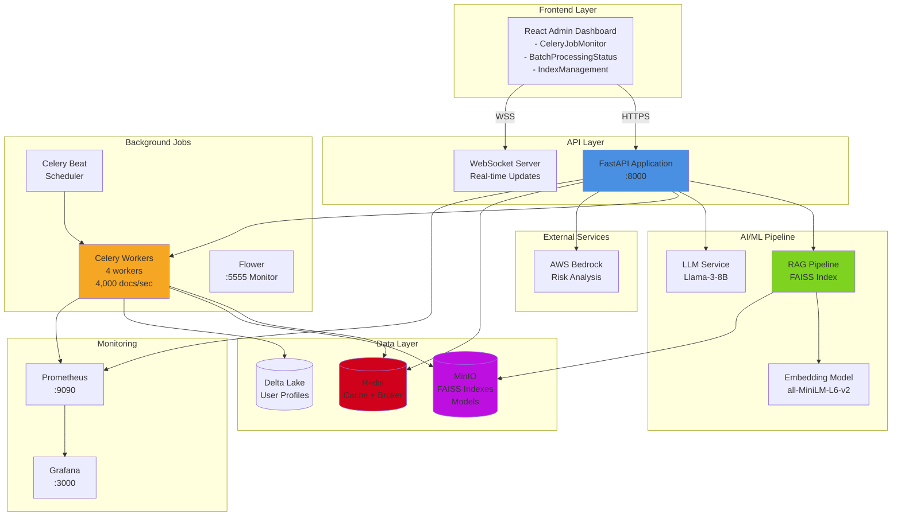
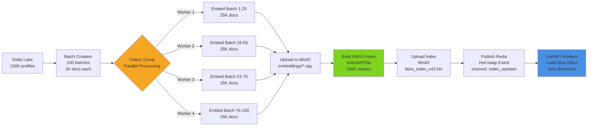
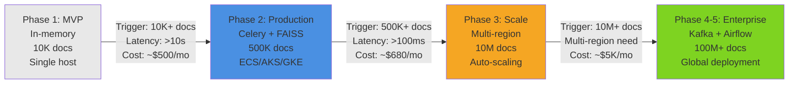
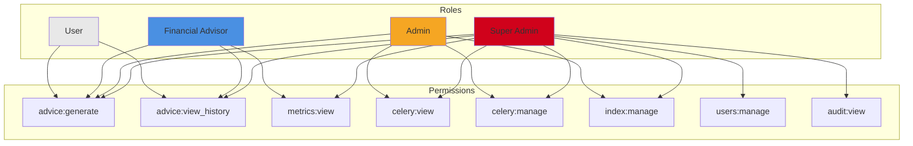

# Suggested Diagrams for Blueprint

Add these 3 diagrams to your blueprint for maximum visual impact.

---

## Diagram 1: APFA System Architecture

**Where to add:** Section 2.0 (System Overview) or Section 0.0 (Backend General)

**Mermaid Code:**


**ASCII Alternative (if Mermaid not supported):**
```
┌─────────────────────────────────────────────────────────────────┐
│                    Frontend (React + Admin UI)                  │
└────────────────────────────┬────────────────────────────────────┘
                             │ HTTPS/WebSocket
┌────────────────────────────▼────────────────────────────────────┐
│                   FastAPI Application (:8000)                   │
│  • JWT Auth + RBAC         • Advice Generation                  │
│  • Admin APIs              • Real-time WebSocket                │
└─────┬──────────┬───────────┬──────────────┬─────────────────────┘
      │          │           │              │
      │    ┌─────▼─────┐ ┌───▼──────┐  ┌───▼──────────┐
      │    │  Redis    │ │  MinIO   │  │  Delta Lake  │
      │    │  Cache    │ │  FAISS   │  │  Profiles    │
      │    │  Broker   │ │  Models  │  │              │
      │    └─────┬─────┘ └──────────┘  └──────────────┘
      │          │
      │    ┌─────▼──────────────────────────────────────┐
      │    │        Celery Workers (4 workers)          │
      │    │  • Batch Embedding: 4,000 docs/sec         │
      │    │  • Index Building: <5s                     │
      │    │  • Hot-swap: 0ms downtime                  │
      │    └────────────────────────────────────────────┘
      │
┌─────▼──────────────┐     ┌──────────────────┐
│   RAG Pipeline     │────▶│  AWS Bedrock     │
│   FAISS + LLM      │     │  Risk Analysis   │
└────────────────────┘     └──────────────────┘
      │
      │
┌─────▼──────────────────────────────────┐
│     Monitoring (Prometheus + Grafana)  │
└────────────────────────────────────────┘
```

---

## Diagram 2: Celery Background Pipeline Flow

**Where to add:** Section 8.0 (Document Processing) or Section 11.0 (AI/ML Pipeline)

**Mermaid Code:**


**ASCII Alternative:**
```
Phase 1: Ingestion
┌─────────────┐
│ Delta Lake  │  Load 100K profiles
│ 100K docs   │
└──────┬──────┘
       │
Phase 2: Batch Creation
       ▼
┌──────────────────┐
│  Split to Batches│  100 batches × 1,000 docs
└──────┬───────────┘
       │
Phase 3: Parallel Embedding (Celery Group)
       ▼
  ┌────┴────┬────────┬────────┐
  │         │        │        │
Worker 1  Worker 2  Worker 3  Worker 4
Batch 1-25 26-50   51-75     76-100
25K docs  25K docs 25K docs  25K docs
  │         │        │        │
  └────┬────┴────────┴────────┘
       │ Upload embeddings
       ▼
  ┌────────────┐
  │   MinIO    │  embeddings/*.npy
  └─────┬──────┘
        │
Phase 4: Index Building
        ▼
  ┌────────────────┐
  │ Build FAISS    │  IndexIVFFlat
  │ 100K vectors   │  <5s duration
  └────────┬───────┘
           │
Phase 5: Hot-swap Deployment
           ▼
  ┌────────────────┐
  │ Upload to MinIO│  faiss_index_v42.bin
  └────────┬───────┘
           │
           ▼
  ┌────────────────┐
  │ Redis Pub/Sub  │  channel: index_updates
  └────────┬───────┘
           │
           ▼
  ┌────────────────┐
  │ FastAPI Reload │  0ms downtime
  │ New Index      │  Hot-swap complete
  └────────────────┘

Performance:
• Throughput: 4,000 docs/sec (40x vs synchronous)
• Total Time: <60s for 100K docs
• Downtime: 0ms (hot-swap)
```

---

## Diagram 3: Phased Evolution Timeline

**Where to add:** Section 1.0 (Introduction) or Architecture Roadmap section

**Mermaid Code:**


**ASCII Alternative:**
```
Phase 1          Phase 2           Phase 3           Phase 4-5
MVP              Production        Scale             Enterprise
─────────────────────────────────────────────────────────────────────
• In-memory      • Celery workers  • Multi-region    • Kafka streams
• Mock data      • FAISS IndexIVF  • Aurora RDS      • Airflow DAGs
• Docker         • Redis cache     • ElastiCache     • ML Platform
• 10K docs       • MinIO/S3        • Active-passive  • Redshift
• Single host    • ECS/AKS/GKE     • Auto-scaling    • Global CDN
• $500/mo        • $680/mo         • $5,000/mo       • $25,000/mo

Latency:         Latency:          Latency:          Latency:
10-100s          <100ms            <50ms             <10ms

Throughput:      Throughput:       Throughput:       Throughput:
100 docs/sec     4,000 docs/sec    10K+ docs/sec     100K+ docs/sec

Capacity:        Capacity:         Capacity:         Capacity:
10K docs         500K docs         10M docs          100M+ docs

    │                │                 │                 │
    │ Triggers:      │ Triggers:       │ Triggers:       │
    │ • >10K docs    │ • >500K vectors │ • >10M docs     │
    │ • Latency >10s │ • Latency >100ms│ • Global users  │
    │ • Need async   │ • Multi-AZ need │ • Compliance++  │
    ▼                ▼                 ▼                 ▼
```

---

## Diagram 4: RBAC Permission Model (Optional)

**Where to add:** Section 5.0 (RBAC) or Section 12.0 (User Authentication)

**Mermaid Code:**


**Table Alternative:**
```
┌─────────────────┬──────────────────────────────────────────────────┐
│ Role            │ Permissions                                      │
├─────────────────┼──────────────────────────────────────────────────┤
│ User            │ • advice:generate                                │
│                 │ • advice:view_history                            │
├─────────────────┼──────────────────────────────────────────────────┤
│ Financial       │ • advice:generate                                │
│ Advisor         │ • advice:view_history                            │
│                 │ • metrics:view                                   │
├─────────────────┼──────────────────────────────────────────────────┤
│ Admin           │ • advice:generate                                │
│                 │ • celery:view                                    │
│                 │ • celery:manage                                  │
│                 │ • index:manage                                   │
├─────────────────┼──────────────────────────────────────────────────┤
│ Super Admin     │ • ALL PERMISSIONS                                │
│                 │ • users:manage                                   │
│                 │ • audit:view                                     │
└─────────────────┴──────────────────────────────────────────────────┘
```

---

## How to Add Diagrams

### Option 1: Mermaid (Recommended)
If your blueprint platform supports Mermaid:
1. Copy the Mermaid code block
2. Paste directly into markdown
3. It will render as a diagram automatically

### Option 2: ASCII Art
If Mermaid not supported:
1. Copy the ASCII alternative
2. Paste into a code block (```text)
3. Ensure monospace font for alignment

### Option 3: External Tool
Create diagrams with:
- **draw.io** (free, exports as PNG/SVG)
- **Lucidchart** (professional)
- **PlantUML** (text-based, like Mermaid)

---

## Impact Assessment

**Adding 2-3 of these diagrams will:**
- ✅ Increase visual appeal (breaks up text)
- ✅ Improve understanding (visual learners)
- ✅ Show communication skills (complex → simple)
- ✅ Demonstrate system thinking (holistic view)
- ✅ Make blueprint memorable (stands out)

**Recommended:**
1. ✅ Diagram 1 (System Architecture) - MUST HAVE
2. ✅ Diagram 2 (Celery Pipeline) - HIGH VALUE
3. ✅ Diagram 3 (Phased Evolution) - STRATEGIC VALUE
4. ⚠️ Diagram 4 (RBAC) - OPTIONAL (only if you want to emphasize security)

---

**Choose 2-3 diagrams and add to your blueprint for maximum impact!**

